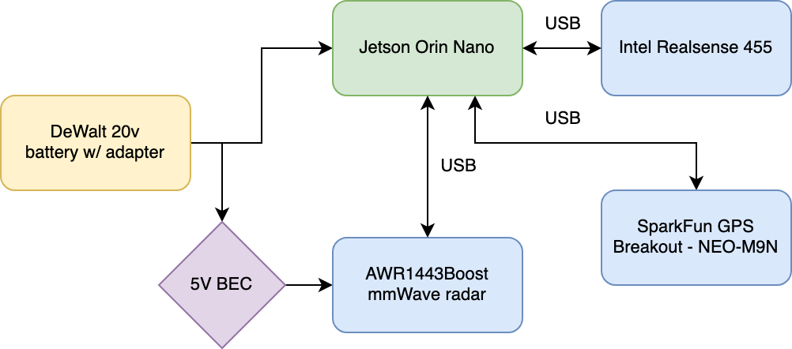

# Bicyclist Defense with NVIDIA Jetson Orin Nano 

Defending Bicyclists from Erratic Drivers with Computer Vision and mmWave Radar


## Recording a Bicycle Trip


The main application is a NextJS and FastAPI server. For data collection, you'll need to have the ffmpeg libraries installed:

```
$ sudo apt-get install -y libavformat-dev libavcodec-dev libavdevice-dev libavutil-dev libswscale-dev libswresample-dev libavfilter-dev
```

To install the Python dependencies you just need to:

```
$ cd bicyclist-defense-jetson/bicycle-app
$ npm i
$ npm run dev
```

> **NOTE:** You may have jittery video if running the application via `npm run dev` in your web browser. This is because _some_ browsers will open two websocket connections due to the way React manages it's state in development in the page load `useEffect`. If you instead do a `npm run build`, followed by an `npm run start`, you should see the completely optimized experience without jitter.

This will spin up a FastAPI server, along with the NextJS server. If you're using Tailscale, you'll be able to see your app on your Tailnet.

From there, you can click "Record 30s" and have 30s of raw sensor data recorded for analysis later. Alternatively, you can click "Record Video", and record as much video of your trip as you like, saved with a timestamp of the beginning of the recording in MP4 format.

> Note: trtexec is in the container at: /usr/src/tensorrt/bin/trtexec

## Running the Server on Startup

I've included an example service for systemd, `bicyclist-protection.service`. Copy this to `/etc/systemd/system/`.

You'll need to replace my username with your username, and the location of this repository's installation there too.

I use [nvm](https://github.com/nvm-sh/nvm) to manage my Node version, so the script loads and does that, as set in `bicycle-app/launch.sh`. Double check that your username and path are set here, replace my values with the ones that match your setup. Then you can reload systemctl and start the service:

```bash
$ sudo systemctl daemon-reload
$ sudo systemctl start bicyclist-protection.service
```

You can check to see if the service started successfully by running a:

```bash
$ journalctl -u  bicyclist-protection
```

If everything went well, you should see something like:

```bash
ubuntu launch.sh[45933]: > concurrently "python3 -m uvicorn api.index:app --host 0.0.0.0" "next start"
ubuntu launch.sh[45949]: [1]    ▲ Next.js 14.1.0
ubuntu launch.sh[45949]: [1]    - Local:        http://localhost:3000
ubuntu launch.sh[45949]: [1]
ubuntu launch.sh[45949]: [1]  ✓ Ready in 676ms
```

And then you should be able to visit the service at port 3000.

If you'd like to monitor your application, I recommmend using the [jetson_stats](https://github.com/rbonghi/jetson_stats) project. Install it with pip:

```bash
$ sudo pip3 install -U jetson-stats
```

Reboot the Jetson, and run it with a `jtop` to monitor usage.


## Replaying in Rerun


You have two ways of using Rerun.

I currently use and run the webapp here to control recording from my iPhone. This lets me hit record when I'm out, and allows the Jetson to record to the SSD I've added to it.

But when I'm developing or adding new sensors, I use an iPython session, and connect to my desktop version of Rerun.

To do this I:

```python
import rerun as rr
import numpy as np

rr.init("realsense")
# connect to my macbook on tailscale
rr.connect("100.79.94.136:9876")

rr.log("any value name", rr.Image(...)) # log your datastructure here
```

The big point is the IP address of my laptop or desktop in the `rr.connect` line. This let's me just stream values over the Tailscale network and see if I've got my data structures right.

## Hardware Setup



I run the device off a [DeWalt 20v](https://amzn.to/3SxmQk0) battery, plugged in to an adapter. I added a second line, going through a [5v BEC](https://amzn.to/4b7muI5) and a [second male plug](https://amzn.to/4b8xjtA) for allowing me to run off my [power supply](https://amzn.to/3S5dIl6) when doing development on my workbench.

## Networking Setup

I've installed Tailscale on my iPhone and my Jetson Orin Nano. 

Once I've done that, I can set up my Jetson Orin Nano to run a webserver for configuration on my phone. My Jetson Orin Nano just needs to tether from my iPhone.

For some reason, I wasn't able to discover the Wifi hotspot from my iPhone until _after_ my laptop connected to it. 

So, in order to have this work:
```
Enable Wifi hotspot on iPhone -> Connect with laptop -> Scan for Wifi -> Find the right mac address -> connect w/ password
```

These commands will scan for the wifi:

```bash
$ sudo nmcli dev wifi rescan
$ sudo nmcli dev wifi
```

And then once you see the address of your Wifi hotspot name you can:

```
$ sudo nmcli d wifi connect AS:0D:20:20:92 password theactualpassword
```

From there, each time you bring up the Jetson, it will autoconnect to the Wifi hotspot.

## Realsense Installation on Jetson Orin Nano

The default installation doesn't seem to work. Here's what I did in order to build:

```bash
$ cd librealsense
$ mkdir build
$ cd build
$ cmake ../ -DBUILD_PYTHON_BINDINGS:bool=true -DPYTHON_EXECUTABLE=/home/stankley/.pyenv/shims/python3 -DBUILD_WITH_CUDA=true -DCMAKE_BUILD_TYPE=release -DBUILD_EXAMPLES=true -DCMAKE_CUDA_ARCHITECTURES=75 -DFORCE_RSUSB_BACKEND=TRUE
$ sudo make install
$ cp /usr/local/OFF/*.so ~/.local/lib/python3.10/site-packages/
```

You'll need to replace `python3.10` with your Python version as appropriate. A `which python3` should start steering you in the right direction.

## Realsense IMU to Orientation Quaternion

I use the [imufusion library](https://github.com/xioTechnologies/Fusion) to do sensor fusion across the accelerometer and gyroscope on the Realsense.

I've also added a [GPS device](https://www.sparkfun.com/products/17285) to (eventually) do correction via heading, which imufusion supports.

## AWR1443 mmWave 

You _must_ use Jetpack 6. Otherwise, there's a bug in the UART controller for the Jetson Orin Nano. 

Once you've done that, install the requirements for the [pymmwave](https://github.com/m6c7l/pymmw) project.

From there, you can edit the `source/mss/14_mmw-xWR14xx.cfg` file to just run the resources you need, and extract running features from the `source/app/` directory.

## Discovering Video Devices for Inference, Running in Containers

Because computer vision research tends to move quickly, it can be tricky to install the correct dependencies to run multiple projects in the same repository. 

To cope with this, and to make your work reproducible, you can use containers. But using containers in embedded systems is a bit trickier than normal container development, as you have to deal with displays, GPUs, volumes, and USB devices all in one go.

It also makes debugging more difficult. For example, if you want to expose a webcam to your container, you have to know which one you want, _before_ you run the container.

So it's not just working from within the container itself. It involves bouncing back and forth between environments, and keeping track of them.

For example, here's how we check and see which devices we have: (make sure you've installed `v4l-utils`)

```
$ v4l2-ctl --list-devices
NVIDIA Tegra Video Input Device (platform:tegra-camrtc-ca):
	/dev/media0

Intel(R) RealSense(TM) Depth Ca (usb-3610000.usb-1.1):
	/dev/video0
	/dev/video1
	/dev/video2
	/dev/video3
	/dev/video4
	/dev/video5
	/dev/media1
	/dev/media2

HD Pro Webcam C920 (usb-3610000.usb-2.2):
	/dev/video6
	/dev/video7
	/dev/media3
```

With this, we can then add a parameter to mount these devices in the container:

```
$ docker run --device /dev/bus/usb --device /dev/video0 --device /dev/video1 --device /dev/video2 --device /dev/video3 --device /dev/video4 --device /dev/video5 --device /dev/video6 --device /dev/video7 <containername> /bin/bash
```

And then run the `nanoowl` process:

```
$ cd /opt/nanoowl/examples/tree_demo
$ python3 tree_demo.py --host 0.0.0.0 --camera 4 /opt/nanoowl/data/owl_image_encoder_patch32.engine
```

Now, the unfortunate thing here is that we need an efficient way to coordinate communication across these sensors and containers.

Robotics platforms like ROS use a message system, using Pub/Sub to submit messages across the system to services that consume them.

